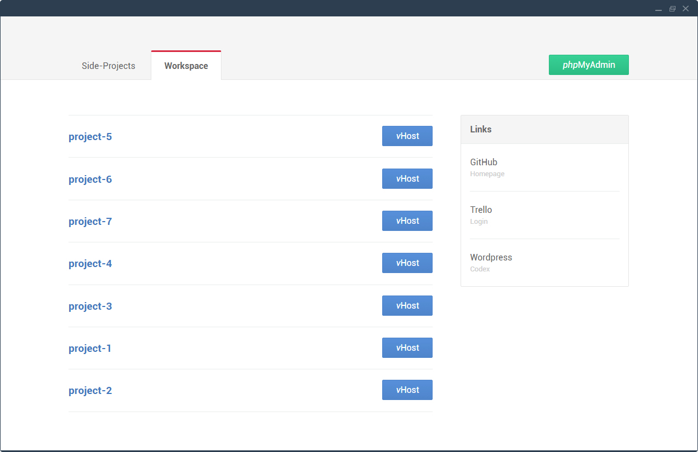

# Localhost Style

A custom index.php and CSS styles for your localhost.

## How To

1. Copy `index.php` and `index-custom-style.css` in the root directory of localhost (e.g. `MAMP/sites`)
2. Create a folder for each category (e.g. `MAMP/sites/workspace` and `MAMP/sites/personal`)
3. Rename `index-workspace.php` to `index.php` and copy it once into every folder you created
4. Open each `index.php` and apply the `active`-class to the current folder/category
5. Open `index.php` in the root directory and change the redirect link to the folder/category of your choice
6. Change and add links to the sidebar as you like

## Notes

* The `vHost`-button only works if you create a virtual host with the same name as the repository
* The project list always displays the last modified project/folder first

## How it looks

